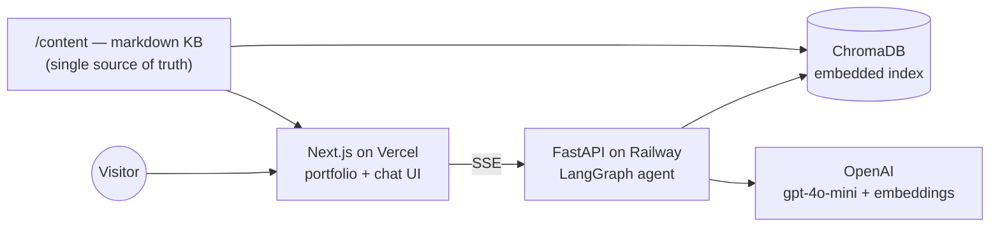

# AI-Powered Portfolio — "A portfolio you can interrogate"

A portfolio that is itself an AI product: a modern portfolio site **plus an AI
Recruiter Assistant** that answers questions about the candidate — grounded in
a real knowledge base via Retrieval-Augmented Generation, with source
citations on every answer and an evaluation suite proving it doesn't hallucinate.

```
Ask it:  "What LLM experience does he have?"
         "Show me his NLP projects."
         "Why should I hire him?"          → answers cite resume, project docs, research notes
```

## Architecture at a glance



The agent is an explicit LangGraph state machine —
`router → retrieve → grade → generate → groundedness check` — so retrieval
quality and generation quality are separately testable, and unanswerable
questions get an honest "I don't know" instead of a hallucination.

**Full documentation:** [System architecture](docs/architecture.md) ·
[RAG pipeline](docs/rag-pipeline.md) · [Agent graph](docs/agent-graph.md) ·
[API](docs/api.md) · [Deployment](docs/deployment.md) ·
[Architecture decision records](docs/decisions/)

## Stack

**Next.js 16 · TypeScript · Tailwind · Framer Motion** — frontend, on Vercel ·
**Python · FastAPI · LangGraph** — backend, Dockerized on Railway ·
**OpenAI gpt-4o-mini + text-embedding-3-small · ChromaDB** — AI layer ·
**GitHub Actions** — CI · **pytest / ruff / eslint / tsc** — quality gates

Why these and not others (including what was deliberately rejected):
[ADR-001](docs/decisions/adr-001-tech-stack.md),
[ADR-002](docs/decisions/adr-002-embedded-chroma.md).

## Run it locally

```bash
# Backend (needs Python 3.11+ and uv)
cd backend
cp .env.example .env          # add OPENAI_API_KEY from Phase 1 onward
uv sync
uv run uvicorn app.main:app --reload --port 8000
# → http://localhost:8000/docs

# Frontend (needs Node 20+)
cd frontend
npm install
npm run dev
# → http://localhost:3000  (chat UI at /chat; talks to the backend on :8000)
```

Or the backend via Docker: `docker compose up --build`.

### Talking to the real AI (OpenAI key)

The backend runs fully **without** a key using deterministic fake providers
(`EMBEDDINGS_PROVIDER=fake`, `LLM_PROVIDER=fake`) — that's how the test suite
runs. For real semantic search and real answers, edit `backend/.env`:

```bash
EMBEDDINGS_PROVIDER=openai
LLM_PROVIDER=openai
OPENAI_API_KEY=sk-...   # set a monthly spend cap in the OpenAI dashboard first
```

Then start the server and try it (ingestion of the whole KB costs < $0.01):

```bash
uv run uvicorn app.main:app --reload --port 8000

curl -N -X POST http://localhost:8000/api/chat \
  -H 'Content-Type: application/json' \
  -d '{"session_id":"local-test-0001","message":"What LLM experience does he have?"}'

curl "http://localhost:8000/api/search?q=kafka+experience&k=3"
```

The chat response streams SSE events: `token` (answer text), `sources`
(citations with document metadata), `meta` (latency, retrieval stats,
groundedness), `done`.

## Evaluating the AI

The RAG system is scored against a golden dataset
(`backend/evals/golden_qa.jsonl`, ~30 hand-authored Q&A items incl.
out-of-scope traps and a prompt-injection attempt):

```bash
cd backend
uv run python -m evals.run          # writes docs/evals/latest.md + latest.json
```

Metrics: retrieval hit-rate@6 and MRR, fact recall, citation presence,
honest-refusal correctness, and — with `LLM_PROVIDER=openai` — LLM-judged
faithfulness and answer relevance. Under fake providers the judge metrics are
reported as *skipped*, never simulated. The `Evals` GitHub Action
(manual trigger) gates on hit-rate ≥ 0.85 and faithfulness ≥ 0.9. Latest
report: [docs/evals/latest.md](docs/evals/latest.md).

## Project status / roadmap

- [x] **Phase 0** — Monorepo scaffold, architecture docs, CI, Docker
- [x] **Phase 1** — Knowledge base content + ingestion pipeline (chunk → embed → index) + `/api/search`
- [x] **Phase 2** — LangGraph RAG agent + streaming `/api/chat` with citations
- [x] **Phase 3** — Chat UI: streaming, citation chips, source panel, feedback
- [x] **Phase 4** — Portfolio site: hero + embedding-field animation, projects, resume, how-it-works
- [x] **Phase 5** — Evaluation harness: golden dataset, hit-rate/MRR, LLM-judge faithfulness
- [x] **Phase 6** — Production readiness: rate limiting, Railway/Vercel config, launch runbook ([docs/deployment.md](docs/deployment.md))
- [ ] **Phase 7** — Advanced: JD Matcher, retrieval transparency, hybrid search

## Repository layout

```
content/    knowledge base — markdown that feeds BOTH the site and the RAG index
frontend/   Next.js app (portfolio pages + chat UI)
backend/    FastAPI app (RAG pipeline, LangGraph agent, evals)
docs/       architecture documentation + ADRs
```
