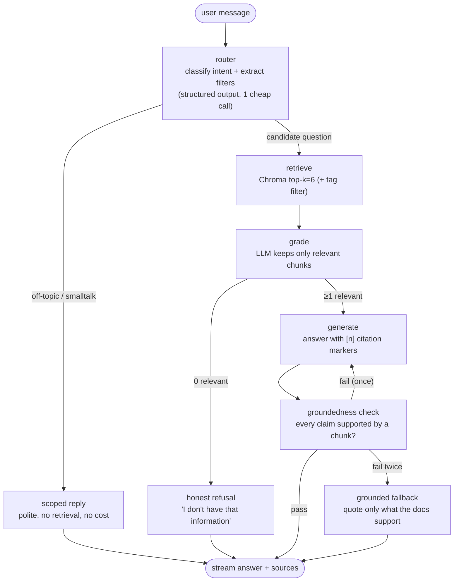

# Agent Architecture (LangGraph)

The assistant is a small, explicit state machine — every node has a
one-sentence justification, and the whole graph fits in one diagram. That is
deliberate: an agent you can fully explain beats an agent that merely sounds
sophisticated.



## Graph state

```python
class AgentState(TypedDict):
    messages: list[Message]          # trimmed session history (~10 turns)
    intent: Intent                   # question | filter_projects | compare | off_topic
    tag_filter: list[str] | None     # e.g. ["nlp"] from "show his NLP projects"
    retrieved: list[Chunk]
    graded: list[Chunk]
    draft: str
    citations: list[Source]
    grounded: bool
    retry_count: int
```

## Node justifications (the interview answers)

| Node | Why it exists |
|---|---|
| **router** | Not every message needs RAG. "Hi!" shouldn't trigger retrieval; "show NLP projects" should become a *filtered* search. One structured-output call on gpt-4o-mini routes and extracts filters simultaneously. |
| **retrieve** | Semantic search over the KB; metadata filters when the router extracted tags. |
| **grade** | The hallucination firewall — vector search always returns nearest neighbors, even for unanswerable questions. Grading converts "nearest" into "actually relevant, or nothing". |
| **generate** | Answers *only* from graded chunks, with mandatory `[n]` markers mapped to chunk metadata. Refusing to answer beyond the docs is in the system prompt's honesty rules. |
| **groundedness** | Post-hoc judge: is every claim in the draft supported by a retrieved chunk? One retry with a stricter prompt, then a conservative fallback. Bounded loop — no unbounded agent spirals. |

## Why LangGraph (and why this shape)

- **vs. one big prompt:** separating route/retrieve/grade/generate makes each
  step independently testable and evaluable — you can measure retrieval
  quality apart from generation quality.
- **vs. heavyweight chain abstractions:** nodes are plain Python functions
  calling the OpenAI SDK directly; LangGraph contributes only the state
  machine, checkpointing hooks, and a visualizable topology.
- **vs. autonomous tool-loop agents:** a portfolio Q&A bot has a known,
  finite workflow. A conditional graph is the honest fit; an open-ended
  ReAct loop would add latency, cost, and failure modes for zero benefit.

Session memory is per-`session_id` message history (TTL ~30 min, in-process —
right-sized for a single-instance deployment; Redis is the documented upgrade
when horizontal scaling ever matters).
