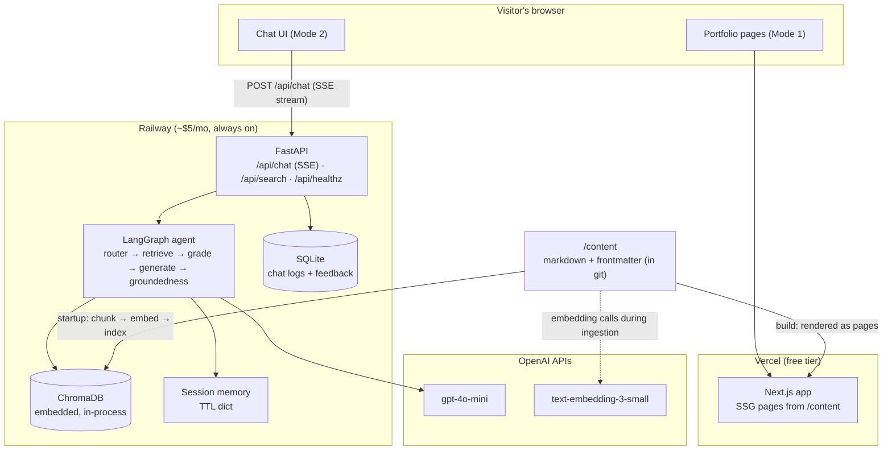

# System Architecture

The portfolio is an AI product with two modes served by two deployable units:

- **Frontend** — Next.js 16 (App Router, TypeScript, Tailwind) on Vercel. Renders
  the portfolio pages (Mode 1) and the AI chat experience (Mode 2).
- **Backend** — FastAPI (Python) on Railway, in Docker. Owns the RAG pipeline,
  the LangGraph agent, session memory, and all OpenAI calls.

## Key design decisions

**Single source of truth.** `/content` (markdown + YAML frontmatter, versioned in
git) feeds both the rendered site and the RAG index. Editing one file updates
what the site *shows* and what the AI *knows* — they can never drift.

**Two deployables, not microservices.** One frontend, one backend. Splitting a
single-developer portfolio into services would be architecture theater; the
honest-scale story is itself an interview talking point.

**Index rebuilt on deploy, not persisted.** The knowledge base is ~50–100
chunks of git-versioned text. Rebuilding the Chroma index at container startup
is deterministic (the index always matches the deployed content), costs under
a cent in embedding calls, and eliminates persistence infrastructure. See
[ADR-002](decisions/adr-002-embedded-chroma.md) for the migration triggers.

**All AI behind the backend.** The browser never talks to OpenAI. The API key
lives only on Railway; CORS is locked to the site's origin; per-IP rate limits
cap spend. The frontend is a pure client of our own API.

## Request lifecycle (chat)

1. Browser POSTs `{session_id, message}` to `/api/chat` and holds the connection open.
2. FastAPI loads session history (in-memory, TTL), invokes the LangGraph agent.
3. Agent: classify intent → retrieve top-k chunks from Chroma → grade relevance
   → generate an answer with `[n]` citation markers → verify groundedness.
4. Tokens stream back over SSE as they are generated; a final event carries
   structured `sources[]` metadata for the citation chips.
5. The turn (question, chunk ids, answer, latency, tokens) is logged to SQLite.

Companion docs: [RAG pipeline](rag-pipeline.md) · [Agent graph](agent-graph.md)
· [API](api.md) · [Deployment](deployment.md) · [ADRs](decisions/)
