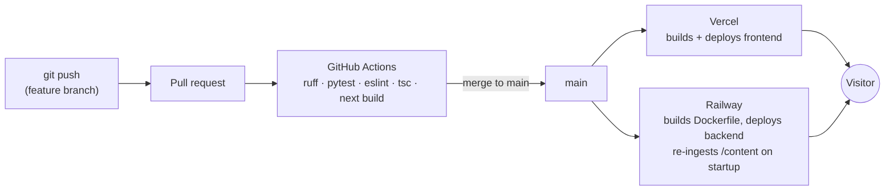

# Deployment

## Environments

| | Local | Production |
|---|---|---|
| Frontend | `npm run dev` (localhost:3000) | Vercel, custom domain |
| Backend | `uv run uvicorn ...` or `docker compose up` (localhost:8000) | Railway, Docker image |
| Secrets | `backend/.env` (gitignored) | Platform env vars only |
| Vector index | rebuilt at startup | rebuilt at startup (same code path — no env drift) |

Environment variables: `OPENAI_API_KEY`, `ALLOWED_ORIGINS`, `ENV`.
`backend/.env.example` documents them; real values never enter git.

## CI/CD

GitHub Actions on every PR: backend (`ruff check`, `pytest`) and frontend
(`eslint`, `tsc --noEmit`, `next build`) as parallel jobs. Deploys are handled
by the platforms' git integrations on merge to `main` — no hand-rolled deploy
scripts to maintain. The eval suite (Phase 5) runs as a manually-triggered
workflow because it spends OpenAI tokens; it gates KB/prompt changes.

## Security

- OpenAI key exists **only** on Railway; the browser never talks to OpenAI.
- CORS allowlist; per-IP rate limits on `/api/chat`; request size caps.
- OpenAI **spend cap + billing alerts** — the backstop if rate limiting fails.
- Container runs as non-root; slim base image; no secrets in the image.
- Prompt-injection: retrieved docs delimited as data (see rag-pipeline.md).

## Monitoring

- Structured JSON logs (Railway log drain); every chat turn logged with
  latency, token counts, retrieval stats to SQLite.
- `/api/healthz` + a free uptime monitor (UptimeRobot) pinging it.
- Optional: LangSmith free tier for full agent traces (Phase 7).

## Cost budget

| Item | Monthly |
|---|---|
| Railway (always-on backend) | ~$5 |
| Vercel hobby | $0 |
| OpenAI (gpt-4o-mini + embeddings, typical traffic) | ~$1–3 |
| Domain (amortized) | ~$1 |
| **Total** | **~$6–8/mo** |

Cold starts were rejected deliberately: a recruiter's first impression cannot
be a 50-second spinner, and $5/mo is the cheapest fix that exists.
