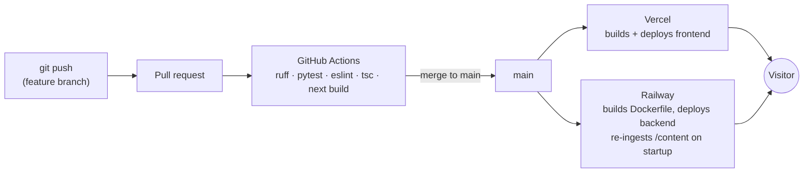

# Deployment

## Environments

| | Local | Production |
|---|---|---|
| Frontend | `npm run dev` (localhost:3000) | Vercel, custom domain |
| Backend | `uv run uvicorn ...` or `docker compose up` (localhost:8000) | Railway, Docker image |
| Secrets | `backend/.env` (gitignored) | Platform env vars only |
| Vector index | rebuilt at startup | rebuilt at startup (same code path — no env drift) |

Environment variables: `OPENAI_API_KEY`, `ALLOWED_ORIGINS`, `ENV`.
`backend/.env.example` documents them; real values never enter git.

## CI/CD

GitHub Actions on every PR: backend (`ruff check`, `pytest`) and frontend
(`eslint`, `tsc --noEmit`, `next build`) as parallel jobs. Deploys are handled
by the platforms' git integrations on merge to `main` — no hand-rolled deploy
scripts to maintain. The eval suite (Phase 5) runs as a manually-triggered
workflow because it spends OpenAI tokens; it gates KB/prompt changes.

## Security

- OpenAI key exists **only** on Railway; the browser never talks to OpenAI.
- CORS allowlist; per-IP rate limits on `/api/chat`; request size caps.
- OpenAI **spend cap + billing alerts** — the backstop if rate limiting fails.
- Container runs as non-root; slim base image; no secrets in the image.
- Prompt-injection: retrieved docs delimited as data (see rag-pipeline.md).

## Monitoring

- Structured JSON logs (Railway log drain); every chat turn logged with
  latency, token counts, retrieval stats to SQLite.
- `/api/healthz` + a free uptime monitor (UptimeRobot) pinging it.
- Optional: LangSmith free tier for full agent traces (Phase 7).

## Go-live runbook (one-time, ~30 minutes)

1. **OpenAI** — create a production API key at platform.openai.com. Set a
   monthly budget cap (e.g. $10) + email alerts FIRST. The cap is the hard
   backstop behind rate limiting.
2. **Railway** — New Project → "Deploy from GitHub repo" → select this repo
   (main branch). `railway.toml` configures the Dockerfile build and
   healthcheck. Set service variables:
   `OPENAI_API_KEY`, `EMBEDDINGS_PROVIDER=openai`, `LLM_PROVIDER=openai`,
   `ENV=production`, `ALLOWED_ORIGINS=https://<your-vercel-domain>` (update
   again in step 4). Settings → Networking → Generate Domain. Verify
   `https://<railway-domain>/api/healthz` returns `index_size > 0` and
   `/docs` renders.
3. **Vercel** — Add New Project → import this repo. Root Directory:
   `frontend` (keep "Include source files outside the Root Directory" ON —
   the build reads `../content`). Environment variable:
   `NEXT_PUBLIC_API_BASE_URL=https://<railway-domain>`. Deploy; open the
   site, run a chat question end to end.
4. **Lock CORS** — set Railway `ALLOWED_ORIGINS` to the final comma-separated
   list (Vercel domain + custom domain when added); redeploy backend.
5. **Custom domain** (optional) — add in Vercel → update `ALLOWED_ORIGINS`.
6. **Uptime** — UptimeRobot free monitor on `/api/healthz`, 5-minute
   interval.
7. **Evals in CI** — add `OPENAI_API_KEY` as a GitHub Actions secret; run the
   `Evals` workflow once from the Actions tab to confirm the gate passes.
8. **Smoke checklist** — on the live site: "Tell me about this candidate" ·
   "Show me his NLP projects" (tag filter) · "What's his favorite food?"
   (refusal) · citation chip opens source panel · 11th rapid chat request in
   a minute returns a friendly 429.

Rollback: Railway → Deployments → redeploy the previous build. Logs: Railway
service logs (backend, structured), Vercel deployment logs (frontend build).

## Rate limits (shipped)

Per client IP via slowapi: `/api/chat` 10/min and 60/day, `/api/search`
30/min, `/api/feedback` 20/min — env-overridable (`RATE_LIMIT_*`).
`/api/healthz` is unlimited. Limits protect spend; the OpenAI budget cap is
the backstop.

## Cost budget

| Item | Monthly |
|---|---|
| Railway (always-on backend) | ~$5 |
| Vercel hobby | $0 |
| OpenAI (gpt-4o-mini + embeddings, typical traffic) | ~$1–3 |
| Domain (amortized) | ~$1 |
| **Total** | **~$6–8/mo** |

Cold starts were rejected deliberately: a recruiter's first impression cannot
be a 50-second spinner, and $5/mo is the cheapest fix that exists.
