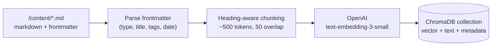
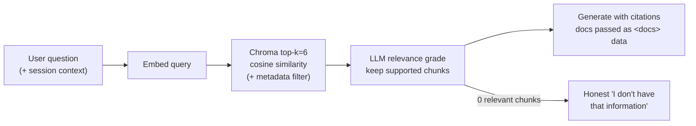

# RAG Pipeline

Retrieval-Augmented Generation grounds every answer in the candidate's real
documents instead of the model's imagination. Two phases: **ingestion**
(offline, at startup) and **retrieval** (per query).

## Ingestion (container startup)

**Chunking strategy.** Split on markdown headings first (a `## Results` section
stays intact), then cap at ~500 tokens with 50-token overlap. Rationale:

- Too small → chunks lose context ("it improved accuracy by 12%" — what did?).
- Too large → retrieval gets blurry (one chunk matches everything weakly) and
  citations become imprecise.
- Heading-aware keeps semantically coherent units together, which also makes
  the citation panel readable to humans.

**Metadata per chunk:** `{doc_type, title, source_file, heading, tags}`.
This enables filtered retrieval — "show his NLP projects" becomes a vector
search *constrained* to `doc_type=project AND tags contains nlp` — and exact
source attribution in the UI.

## Retrieval (per query)

**Why grade after retrieval?** Vector search always returns *something* — the
top-6 nearest neighbors exist even for "what's his favorite pizza?". The
grading step is the hallucination firewall: if nothing retrieved actually
bears on the question, the agent says so instead of improvising.

**Prompt-injection stance.** Retrieved text is wrapped in `<docs>` tags and the
system prompt states it is data, never instructions. The KB is self-authored,
so risk is low today — but the JD Matcher (Phase 7) ingests *visitor-pasted*
text, and this defense is load-bearing there.

## Quality measurement

The eval harness (`backend/evals/`, Phase 5) scores this pipeline on a golden
Q&A dataset: retrieval hit-rate@6 and MRR, plus LLM-judged faithfulness and
answer relevance. Ship gate: hit-rate ≥ 0.9, faithfulness ≥ 0.9.

## Documented upgrade paths (not yet needed — see ADR-002)

- **Hybrid retrieval** (BM25 + vector, reciprocal-rank fusion) when exact-term
  queries ("PyTorch", cert IDs) underperform in evals.
- **Reranking** (cross-encoder) if k must grow beyond ~10.
- **Managed vector DB** (Qdrant/pgvector) when the index outgrows
  rebuild-on-deploy: user-generated data, multi-instance serving, or
  ingestion cost/time that no longer rounds to zero.
